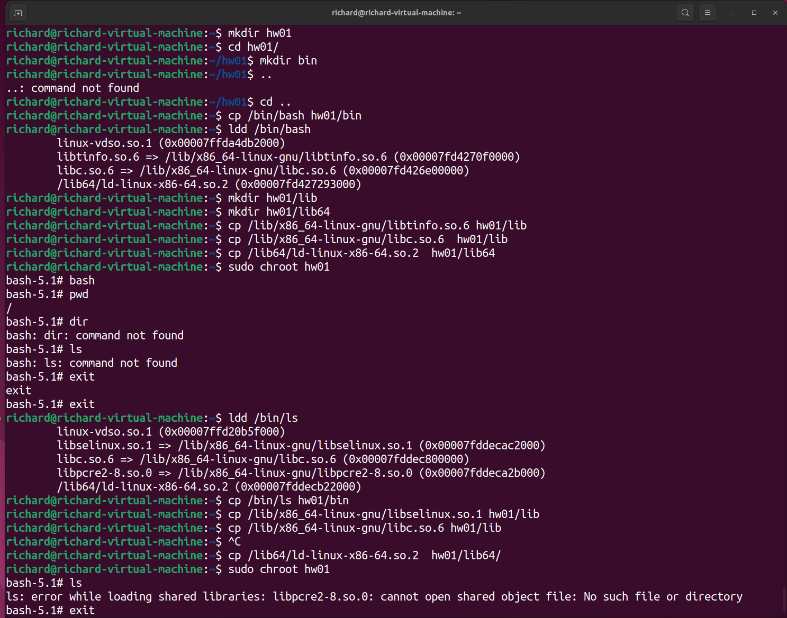
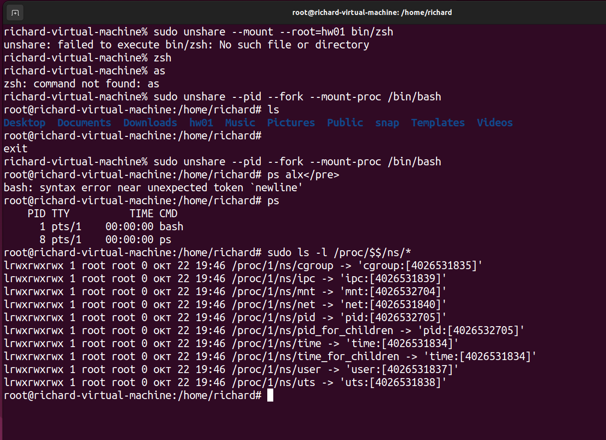

```bash
richard@richard-virtual-machine:~$ pwd
/home/richard
richard@richard-virtual-machine:~$ mkdir hw01
richard@richard-virtual-machine:~$ cd hw01/
richard@richard-virtual-machine:~/hw01$ mkdir bin
richard@richard-virtual-machine:~/hw01$ ..
..: command not found
richard@richard-virtual-machine:~/hw01$ cd ..
richard@richard-virtual-machine:~$ cp /bin/bash hw01/bin
richard@richard-virtual-machine:~$ ldd /bin/bash
	linux-vdso.so.1 (0x00007ffda4db2000)
	libtinfo.so.6 => /lib/x86_64-linux-gnu/libtinfo.so.6 (0x00007fd4270f0000)
	libc.so.6 => /lib/x86_64-linux-gnu/libc.so.6 (0x00007fd426e00000)
	/lib64/ld-linux-x86-64.so.2 (0x00007fd427293000)
richard@richard-virtual-machine:~$ mkdir hw01/lib
richard@richard-virtual-machine:~$ mkdir hw01/lib64
richard@richard-virtual-machine:~$ cp /lib/x86_64-linux-gnu/libtinfo.so.6 hw01/lib
richard@richard-virtual-machine:~$ cp /lib/x86_64-linux-gnu/libc.so.6  hw01/lib
richard@richard-virtual-machine:~$ cp /lib64/ld-linux-x86-64.so.2  hw01/lib64
richard@richard-virtual-machine:~$ sudo chroot hw01
bash-5.1# bash
bash-5.1# pwd
/
bash-5.1# dir
bash: dir: command not found
bash-5.1# ls
bash: ls: command not found
bash-5.1# exit
exit
bash-5.1# exit
richard@richard-virtual-machine:~$ ldd /bin/ls
	linux-vdso.so.1 (0x00007ffd20b5f000)
	libselinux.so.1 => /lib/x86_64-linux-gnu/libselinux.so.1 (0x00007fddecac2000)
	libc.so.6 => /lib/x86_64-linux-gnu/libc.so.6 (0x00007fddec800000)
	libpcre2-8.so.0 => /lib/x86_64-linux-gnu/libpcre2-8.so.0 (0x00007fddeca2b000)
	/lib64/ld-linux-x86-64.so.2 (0x00007fddecb22000)
richard@richard-virtual-machine:~$ cp /bin/ls hw01/bin
richard@richard-virtual-machine:~$ cp /lib/x86_64-linux-gnu/libselinux.so.1 hw01/lib
richard@richard-virtual-machine:~$ cp /lib/x86_64-linux-gnu/libc.so.6 hw01/lib
richard@richard-virtual-machine:~$ ^C
richard@richard-virtual-machine:~$ cp /lib64/ld-linux-x86-64.so.2  hw01/lib64/
richard@richard-virtual-machine:~$ sudo chroot hw01
bash-5.1# ls
ls: error while loading shared libraries: libpcre2-8.so.0: cannot open shared object file: No such file or directory
bash-5.1# exit
richard@richard-virtual-machine:~$ cp /lib/x86_64-linux-gnu/libpcre2-8.so.0 hw01/lib
richard@richard-virtual-machine:~$ sudo chroot hw01
bash-5.1# ls
bin  lib  lib64
bash-5.1#         

```



```bash
richard-virtual-machine% sudo unshare --pid --fork --mount-proc /bin/bash
root@richard-virtual-machine:/home/richard# ls
Desktop  Documents  Downloads  hw01  Music  Pictures  Public  snap  Templates  Videos
root@richard-virtual-machine:/home/richard# 
exit
richard-virtual-machine% sudo unshare --pid --fork --mount-proc /bin/bash
root@richard-virtual-machine:/home/richard# ps alx</pre>
bash: syntax error near unexpected token `newline'
root@richard-virtual-machine:/home/richard# ps 
    PID TTY          TIME CMD
      1 pts/1    00:00:00 bash
      8 pts/1    00:00:00 ps
root@richard-virtual-machine:/home/richard# sudo ls -l /proc/$$/ns/*
lrwxrwxrwx 1 root root 0 окт 22 19:46 /proc/1/ns/cgroup -> 'cgroup:[4026531835]'
lrwxrwxrwx 1 root root 0 окт 22 19:46 /proc/1/ns/ipc -> 'ipc:[4026531839]'
lrwxrwxrwx 1 root root 0 окт 22 19:46 /proc/1/ns/mnt -> 'mnt:[4026532704]'
lrwxrwxrwx 1 root root 0 окт 22 19:46 /proc/1/ns/net -> 'net:[4026531840]'
lrwxrwxrwx 1 root root 0 окт 22 19:46 /proc/1/ns/pid -> 'pid:[4026532705]'
lrwxrwxrwx 1 root root 0 окт 22 19:46 /proc/1/ns/pid_for_children -> 'pid:[4026532705]'
lrwxrwxrwx 1 root root 0 окт 22 19:46 /proc/1/ns/time -> 'time:[4026531834]'
lrwxrwxrwx 1 root root 0 окт 22 19:46 /proc/1/ns/time_for_children -> 'time:[4026531834]'
lrwxrwxrwx 1 root root 0 окт 22 19:46 /proc/1/ns/user -> 'user:[4026531837]'
lrwxrwxrwx 1 root root 0 окт 22 19:46 /proc/1/ns/uts -> 'uts:[4026531838]'
root@richard-virtual-machine:/home/richard# 
```



```bash
richard-virtual-machine% ip a
1: lo: <LOOPBACK,UP,LOWER_UP> mtu 65536 qdisc noqueue state UNKNOWN group default qlen 1000
    link/loopback 00:00:00:00:00:00 brd 00:00:00:00:00:00
    inet 127.0.0.1/8 scope host lo
       valid_lft forever preferred_lft forever
    inet6 ::1/128 scope host 
       valid_lft forever preferred_lft forever
2: ens33: <BROADCAST,MULTICAST,UP,LOWER_UP> mtu 1500 qdisc fq_codel state UP group default qlen 1000
    link/ether 00:0c:29:42:f3:54 brd ff:ff:ff:ff:ff:ff
    altname enp2s1
    inet 192.168.239.132/24 brd 192.168.239.255 scope global dynamic noprefixroute ens33
       valid_lft 991sec preferred_lft 991sec
    inet6 fe80::6449:82d0:4839:54a9/64 scope link noprefixroute 
       valid_lft forever preferred_lft forever
richard-virtual-machine% sudo unshare --pid --net --fork --mount-proc /bin/bash
root@richard-virtual-machine:/home/richard# ip a
1: lo: <LOOPBACK> mtu 65536 qdisc noop state DOWN group default qlen 1000
    link/loopback 00:00:00:00:00:00 brd 00:00:00:00:00:00
root@richard-virtual-machine:/home/richard# 

```