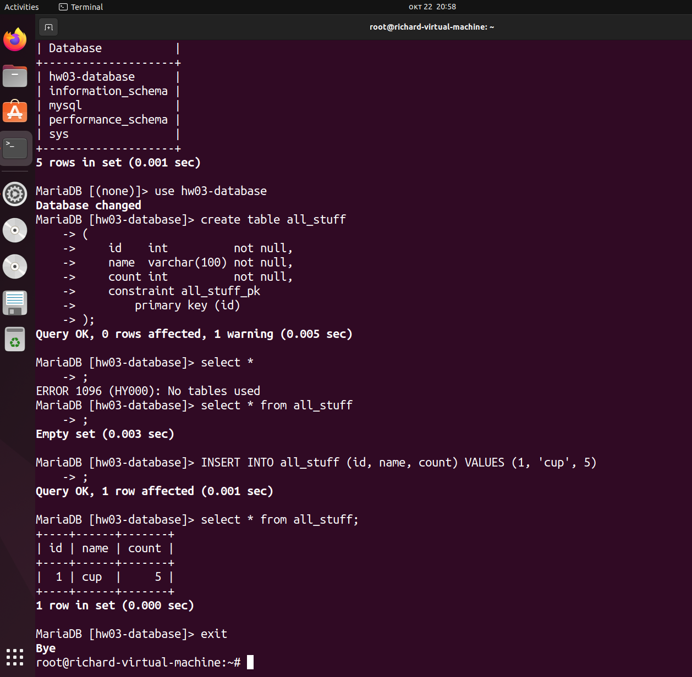
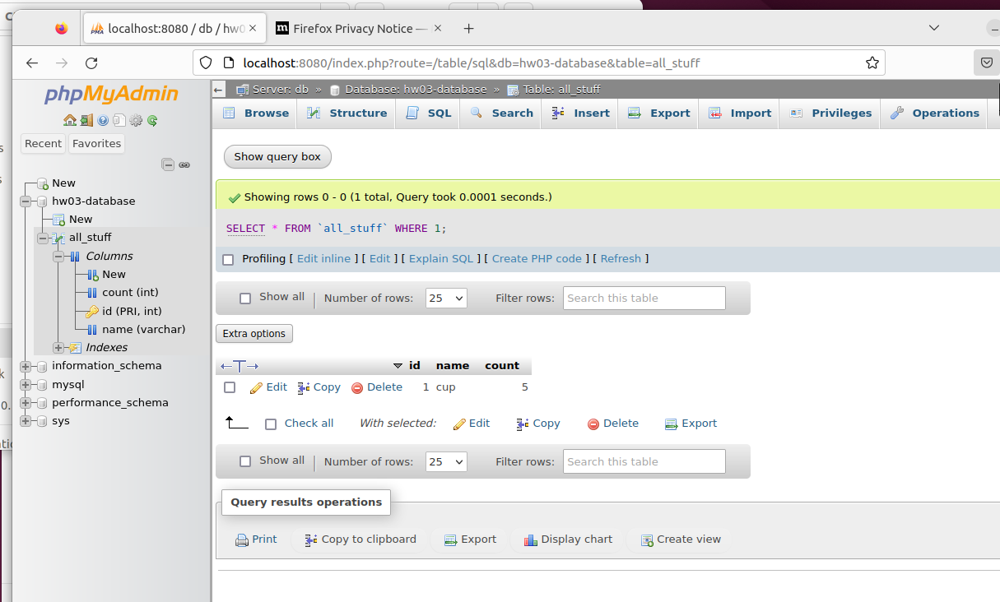

```bash

root@richard-virtual-machine:~# docker network create hw03-network
bf51fdd9f29ef8e930645c15b6b4a7e0b8430461d1851f0df32c9863a33e1923
root@richard-virtual-machine:~# docker run --detach --network hw03-network --name hw03-mariadb --env MARIADB_USER=example-user --env MARIADB_PASSWORD=my_cool_secret --env MARIADB_ROOT_PASSWORD=my-secret-pw  mariadb:latest
Unable to find image 'mariadb:latest' locally
latest: Pulling from library/mariadb
43f89b94cd7d: Pull complete 
dfb413a01c7e: Pull complete 
1d3f76b535d3: Pull complete 
f7efd05ec01e: Pull complete 
fe2ff83c75df: Pull complete 
50ee0c078c93: Pull complete 
6975e72928bb: Pull complete 
561d1b426cbd: Pull complete 
Digest: sha256:2403cc521634162f743b5179ff5b35520daf72df5d9e7e397192af685d9148fd
Status: Downloaded newer image for mariadb:latest
098972b054d71767633c6c9bc6dd9295b2f296a421b12be1cfb481d6ea6865d3
root@richard-virtual-machine:~# docker images
REPOSITORY    TAG       IMAGE ID       CREATED        SIZE
mariadb       latest    f35870862d64   9 days ago     404MB
hello-world   latest    9c7a54a9a43c   5 months ago   13.3kB
root@richard-virtual-machine:~# docker ps
CONTAINER ID   IMAGE            COMMAND                  CREATED              STATUS              PORTS      NAMES
098972b054d7   mariadb:latest   "docker-entrypoint.s…"   About a minute ago   Up About a minute   3306/tcp   hw03-mariadb
root@richard-virtual-machine:~# $ docker run -it --network hw03-network --rm mariadb mariadb -hhw03-mariadb -uexample-user -p
$: command not found
root@richard-virtual-machine:~# $ docker run -it --network hw03-network --rm mariadb mariadb -hhw03-mariadb -uexample-user -p
$: command not found
root@richard-virtual-machine:~# $ docker run -it --network hw03-network --rm mariadb mariadb -uexample-user -p
$: command not found
root@richard-virtual-machine:~# $ docker run -it --network hw03-network --rm mariadb mariadb -uexample-user -p
$: command not found
root@richard-virtual-machine:~# $ docker run 
$: command not found
root@richard-virtual-machine:~# $ docker run hello-world
$: command not found
root@richard-virtual-machine:~# docker run -it --network hw03-network --rm mariadb mariadb -hhw03-mariadb -uexample-user -p
Enter password: 
ERROR 1045 (28000): Access denied for user 'example-user'@'172.18.0.3' (using password: YES)
root@richard-virtual-machine:~# docker run -it --network hw03-network --rm mariadb mariadb -hhw03-mariadb -uexample-user -p
Enter password: 
ERROR 1045 (28000): Access denied for user 'example-user'@'172.18.0.3' (using password: YES)
root@richard-virtual-machine:~# docker run -it --network hw03-network --rm mariadb mariadb -hhw03-mariadb -uexample-user -p
Enter password: 
Welcome to the MariaDB monitor.  Commands end with ; or \g.
Your MariaDB connection id is 5
Server version: 11.1.2-MariaDB-1:11.1.2+maria~ubu2204 mariadb.org binary distribution

Copyright (c) 2000, 2018, Oracle, MariaDB Corporation Ab and others.

Type 'help;' or '\h' for help. Type '\c' to clear the current input statement.

MariaDB [(none)]> select *
    -> show databases
    -> show databases;
ERROR 1064 (42000): You have an error in your SQL syntax; check the manual that corresponds to your MariaDB server version for the right syntax to use near 'show databases
show databases' at line 2
MariaDB [(none)]> SHOW DATABASES;
+--------------------+
| Database           |
+--------------------+
| information_schema |
+--------------------+
1 row in set (0.001 sec)

MariaDB [(none)]> CREATE DATABASE `HW03-DATABASE` CHARACTER SET utf8 COLLATE utf8_general_ci;
ERROR 1044 (42000): Access denied for user 'example-user'@'%' to database 'HW03-DATABASE'
MariaDB [(none)]> exit
Bye
root@richard-virtual-machine:~# docker run -it --network hw03-network --rm mariadb mariadb -hhw03-mariadb -uroot -p
Enter password: 
Welcome to the MariaDB monitor.  Commands end with ; or \g.
Your MariaDB connection id is 6
Server version: 11.1.2-MariaDB-1:11.1.2+maria~ubu2204 mariadb.org binary distribution

Copyright (c) 2000, 2018, Oracle, MariaDB Corporation Ab and others.

Type 'help;' or '\h' for help. Type '\c' to clear the current input statement.

MariaDB [(none)]> CREATE DATABASE `hw03-database` CHARACTER SET utf8 COLLATE utf8_general_ci;
Query OK, 1 row affected (0.000 sec)

MariaDB [(none)]> show databases;
+--------------------+
| Database           |
+--------------------+
| hw03-database      |
| information_schema |
| mysql              |
| performance_schema |
| sys                |
+--------------------+
5 rows in set (0.001 sec)

MariaDB [(none)]> use hw03-database
Database changed
MariaDB [hw03-database]> create table all_stuff
    -> (
    ->     id    int          not null,
    ->     name  varchar(100) not null,
    ->     count int          not null,
    ->     constraint all_stuff_pk
    ->         primary key (id)
    -> );
Query OK, 0 rows affected, 1 warning (0.005 sec)

MariaDB [hw03-database]> select *
    -> ;
ERROR 1096 (HY000): No tables used
MariaDB [hw03-database]> select * from all_stuff
    -> ;
Empty set (0.003 sec)

MariaDB [hw03-database]> INSERT INTO all_stuff (id, name, count) VALUES (1, 'cup', 5)
    -> ;
Query OK, 1 row affected (0.001 sec)

MariaDB [hw03-database]> select * from all_stuff;
+----+------+-------+
| id | name | count |
+----+------+-------+
|  1 | cup  |     5 |
+----+------+-------+
1 row in set (0.000 sec)

MariaDB [hw03-database]> exit
Bye
root@richard-virtual-machine:~# 
```



```bash


root@richard-virtual-machine:~# docker network ls
NETWORK ID     NAME           DRIVER    SCOPE
4371ff87643b   bridge         bridge    local
5f7625557a4b   host           host      local
bf51fdd9f29e   hw03-network   bridge    local
389f38ec8e29   none           null      local
root@richard-virtual-machine:~# docker run --name phpmyadmin -d --link hw03-mariadb:db --net hw03-network -p 8080:80 phpmyadmin
docker: Error response from daemon: Conflict. The container name "/phpmyadmin" is already in use by container "691e79edc1c8b768e21af2e9c5c62ce4db370fa8904cdd32c28dea28aad4ca99". You have to remove (or rename) that container to be able to reuse that name.
See 'docker run --help'.
root@richard-virtual-machine:~# docker run --name phpmyadmin2 -d --link hw03-mariadb:db --net hw03-network -p 8080:80 phpmyadmin
bd8e2c851c5534473668c79578ccef4e6d4dffd32f30216f070007eb538f7559
root@richard-virtual-machine:~# docker run -it --network hw03-network --rm mariadb mariadb -hhw03-mariadb -uroot -p
Enter password: 
Welcome to the MariaDB monitor.  Commands end with ; or \g.
Your MariaDB connection id is 52
Server version: 11.1.2-MariaDB-1:11.1.2+maria~ubu2204 mariadb.org binary distribution

Copyright (c) 2000, 2018, Oracle, MariaDB Corporation Ab and others.

Type 'help;' or '\h' for help. Type '\c' to clear the current input statement.

MariaDB [(none)]> select * all_stuff
    -> ;
ERROR 1064 (42000): You have an error in your SQL syntax; check the manual that corresponds to your MariaDB server version for the right syntax to use near 'all_stuff' at line 1
MariaDB [(none)]> show databases;
+--------------------+
| Database           |
+--------------------+
| hw03-database      |
| information_schema |
| mysql              |
| performance_schema |
| sys                |
+--------------------+
5 rows in set (0.001 sec)

MariaDB [(none)]> use hw03-database
Reading table information for completion of table and column names
You can turn off this feature to get a quicker startup with -A

Database changed
MariaDB [hw03-database]> select * 
    -> ;
ERROR 1096 (HY000): No tables used
MariaDB [hw03-database]> select * from all_staff
    -> ;
ERROR 1146 (42S02): Table 'hw03-database.all_staff' doesn't exist
MariaDB [hw03-database]> select * from all_stuff;
+----+------+-------+
| id | name | count |
+----+------+-------+
|  1 | cup  |     5 |
+----+------+-------+
1 row in set (0.000 sec)

MariaDB [hw03-database]> Ctrl-C -- exit!
Aborted
root@richard-virtual-machine:~# 
```


