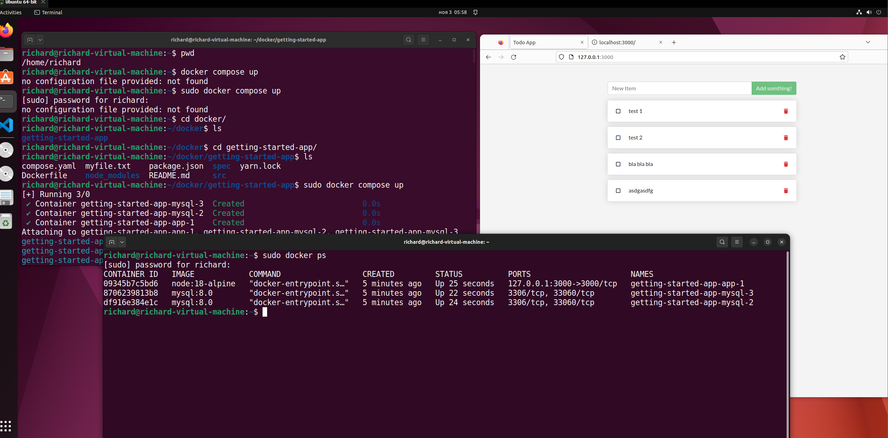
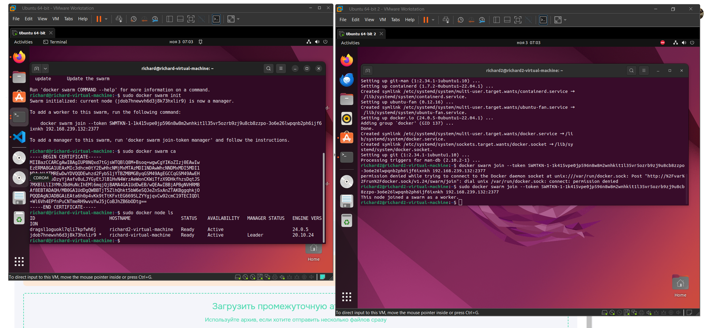
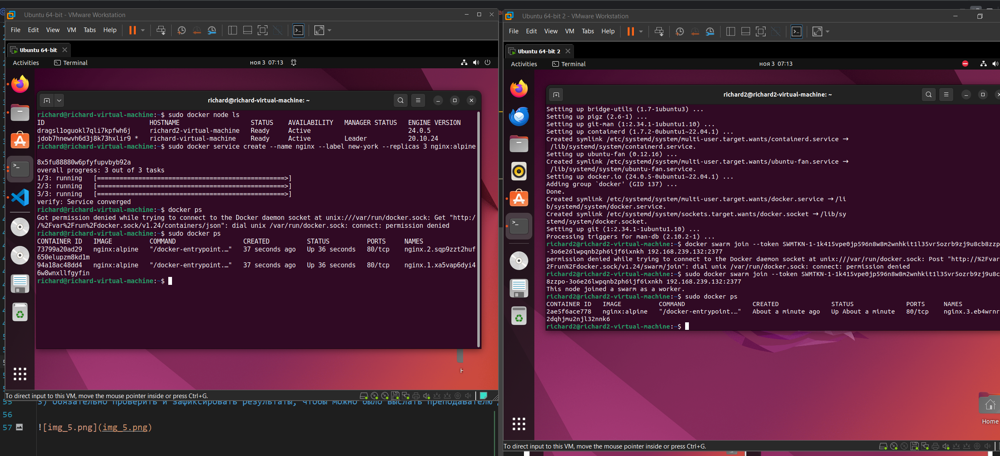

### Задание 1:
1) создать docker compose файл, состоящий из 2 различных контейнеров: 1 - веб, 2 - БД
2) запустить docker compose файл
3) по итогу на БД контейнере должно быть 2 реплики, на админере должна быть 1 реплика. Всего должно получиться 3 контейнера
4) выводы зафиксировать

Я решил повторить обучение на сайте docker. Модифицировал файл из docker lern
Не Adminer - но тоже данные видно на страничке приложения


[compose.yaml](getting-started-app%2Fcompose.yaml)
```yaml
version: '3.9'

services:
  app:
    image: node:18-alpine
    command: sh -c "yarn install && yarn run dev"
    ports:
      - 127.0.0.1:3000:3000
    working_dir: /app
    volumes:
      - ./:/app
    environment:
      MYSQL_HOST: mysql
      MYSQL_USER: root
      MYSQL_PASSWORD: secret
      MYSQL_DB: todos
    restart: unless-stopped
    deploy:
      mode: replicated
      replicas: 1
    
  mysql:
    image: mysql:8.0
    volumes:
      - todo-mysql-data:/var/lib/mysql
    environment:
      MYSQL_ROOT_PASSWORD: secret
      MYSQL_DATABASE: todos
    restart: unless-stopped
    deploy:
      mode: replicated
      replicas: 2

volumes:
  todo-mysql-data:
```



### Задание 2*:
1) создать кластер и мастер и слейв ноды
2) задеплоить на ноду несколько экземляров какого0нибудь контейнера, например nginx
3) обязательно проверить и зафиксировать результаты, чтобы можно было выслать преподавателю для проверки



